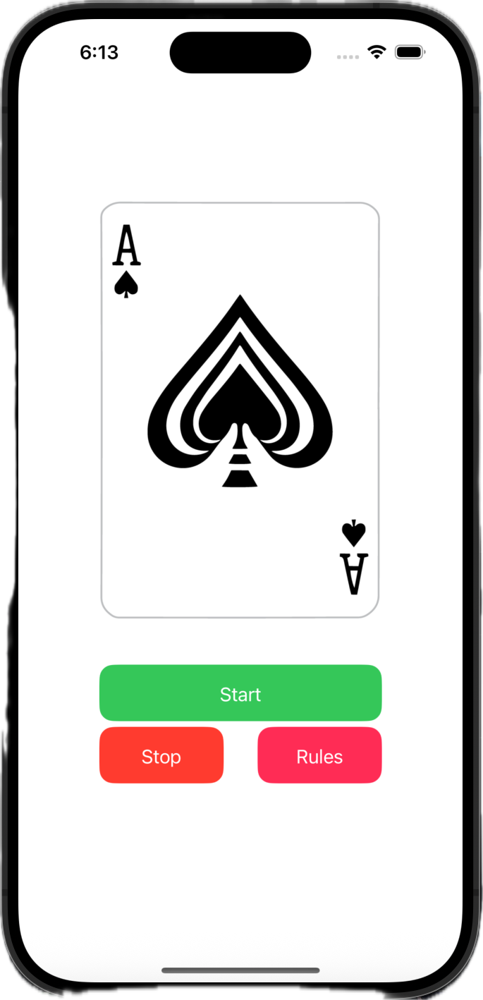
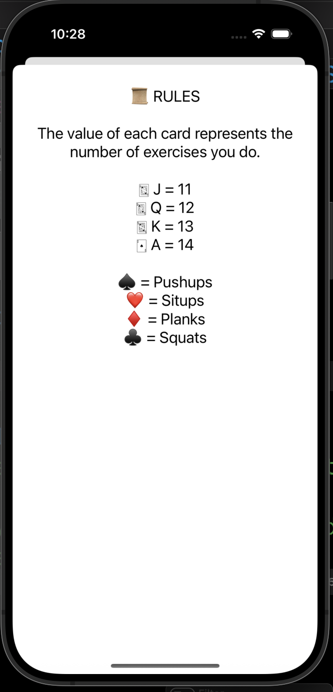

# 🃏 Card Workout App 

A fast-paced workout app that displays a randomly shuffled deck of cards, with each card representing a different exercise. Built **entirely using Swift code** without Storyboards, this app is an excellent example of using **Programmatic UI** in iOS development.


---

## 📸 App Preview

<table>
  <tr>
    <td></td>
    <td>   </td>
  </tr>
  <tr>
    <td align="center">Main Screen (Card Screen)</td>
     <td align="center">Rules Screen  (Rules Screen)</td>
  </tr>
</table>

<br/>


---

## 📱 Overview

The Card Workout App continuously cycles through a deck of 52 playing cards. Users can tap:

- 🛑 **Start** to halt the shuffle and reveal the exercise.
- 🔄 **Stop** to Stop Cards flipping.
- 📜 **Rules** to show the exercise-to-card mapping.

All UI is created programmatically, with layout done via Auto Layout in code.

---

## ✨ Features

- 🎴 **Random Card Generator**: Shuffles through the entire deck at high speed.
- ⏹ **Stop **: Stops the timer and card flipping.
- 📖 **Workout Rules Modal**: Clearly explains which suits correspond to which exercises.
- 🔁 **Custom UI Components**: Reusable `CWButton` class for consistent and DRY styling.
- 🧱 **Programmatic Auto Layout**: Zero Storyboards. Full layout via code.
- ⏱ **NSTimer-Driven Animation**: Animates the shuffle using a timer.
- 🧠 **Clean Architecture**: ViewController separation, reusable data model for the deck.

---

## 🧠 Key Concepts Demonstrated

- **SceneDelegate-Based App Setup** (no Storyboard)
- **UIButton Subclassing** (`CWButton`)
- **Auto Layout in Code** (`NSLayoutConstraint.activate`)
- **Target-Action Pattern** with `addTarget` and `@objc` selectors
- **Modal Presentation** using `present()`
- **ViewController Lifecycle** management (e.g., `viewDidLoad`, `viewWillDisappear`)
- **Use of SF Symbols** and `UIImage(systemName:)`
- **Implicitly Unwrapped Optionals** with safe usage for `Timer`

---

## 🧰 Technologies & Tools

- Swift 5
- UIKit
- SF Symbols
- Auto Layout (Programmatic)
- Xcode 14+

---

## 🧱 Project Architecture

### 🔹 UI Setup (No Storyboard)

All UI elements (`UIImageView`, `UIButton`, `UILabel`) are created and constrained directly in Swift:

- `translatesAutoresizingMaskIntoConstraints = false`
- Layout via `NSLayoutConstraint.activate([...])`

### 🔹 CWButton.swift

A reusable button subclass:
```swift
class CWButton: UIButton {
    init(backgroundColor: UIColor, title: String, systemImageName: String) {
        super.init(frame: .zero)
        configuration = .tinted()
        configuration?.baseBackgroundColor = backgroundColor
        configuration?.title = title
        configuration?.image = UIImage(systemName: systemImageName)
        configuration?.imagePadding = 6
        configuration?.cornerStyle = .medium
        translatesAutoresizingMaskIntoConstraints = false
    }
   required init?(coder: NSCoder) {
        fatalError("init(coder:) has not been implemented")
    }
}
---
```
### 🔹 SceneDelegate.swift
```swift
  window = UIWindow(windowScene: windowScene)
window?.rootViewController = CardSelectionVC()
window?.makeKeyAndVisible()

```
###  🔹 CardDeck.swift
```swift
struct CardDeck {
    static let allValues: [UIImage] = {
        var cards: [UIImage] = []
        // load images named "2C", "3D", "AS", etc.
        // must be added to Assets.xcassets
        return cards
    }()
}

###  🧩 Buttons & Actions
```swift
stopButton.addTarget(self, action: #selector(stopTimer), for: .touchUpInside)
restartButton.addTarget(self, action: #selector(resetTimer), for: .touchUpInside)
rulesButton.addTarget(self, action: #selector(presentRulesVC), for: .touchUpInside)

```
### ⚙️ App Logic

🔁 Timer-Based Card Shuffle
Uses Timer.scheduledTimer with a 0.1s interval.
Updates the UIImageView with a random image from CardDeck.allValues.
startTimer(), stopTimer()  handle timer control.
🧾 Rules Presentation
The RulesVC is presented modally using .present(...).
Explains what each suit means (e.g., ♠ = Push-ups, ♥ = Sit-ups).


 
